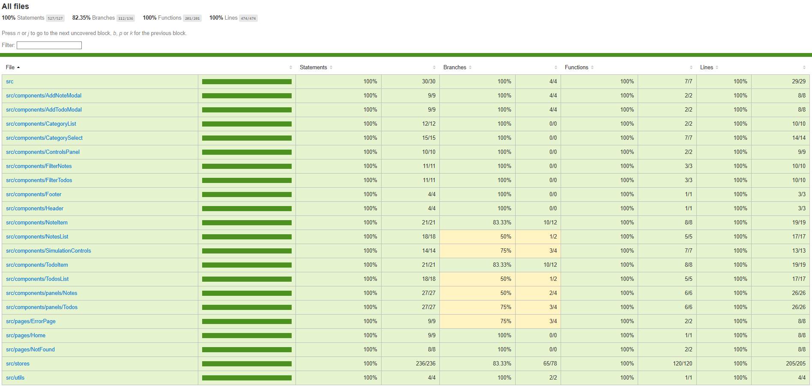

# Optimistic UI Sandbox

This isn’t your typical boring todo app.

It features a built-in **Controls Panel** where you can simulate **network latency** and trigger **server errors** to see how the app behaves under stress. Every interaction uses **optimistic UI updates**, so changes appear instantly while "background operations complete", just like in real-world apps.

There’s **no real API**, everything is **fully mocked**, including delays and failures, to simulate realistic network conditions.

A hands-on playground to explore how a real UI should behave when things go wrong, from slow responses to failed requests.

---

## ✨ Features

- **Optimistic UI** updates for todos and notes
- Built with React, TypeScript and **Zustand**
- **Control Panel** to simulate:
  - Artificial network **latency**
  - Randomized **server errors**
- Graceful **error handling** and recovery flows
- **Unit + integration tests** using **Jest** and **React Testing Library**
- **Test coverage**: **100%**
  
- Fully typed with **TypeScript**

---

**Checkout the live demo**: [Optimistic UI Sandbox](https://startling-shortbread-4b5781.netlify.app/)

## 📁 Project Location

This app lives in the [`apps/optimistic-ui-sandbox`](https://github.com/giuseppe-messi/react-lab-mono/tree/main/apps/optimistic-ui-sandbox) directory of the [`react-lab-mono`](https://github.com/giuseppe-messi/react-lab-mono) monorepo.

---
